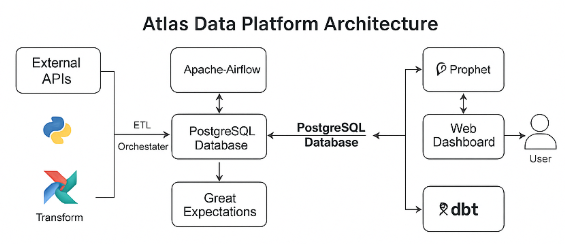

# Atlas Data Platform

[](https://www.python.org/)
[](https://streamlit.io/)
[](https://www.postgresql.org/)
[](https://airflow.apache.org/)
[](https://www.getdbt.com/)
[](https://greatexpectations.io/)
[](https://facebook.github.io/prophet/)
[](LICENSE)

---

## Author

**Harun SEZGIN**  
Data Engineering & Analytics Enthusiast  
[LinkedIn](https://www.linkedin.com/in/harun-sezgin-925a2924b/) · [GitHub](https://github.com/sezg0002)

---

## Overview

Atlas Data Platform is an end-to-end data intelligence product.

The project covers the complete lifecycle of a data product:

1. Ingesting external economic and financial data from public APIs.  
2. Loading and structuring the data into a PostgreSQL data warehouse.  
3. Transforming raw data into analytics-ready models with dbt.  
4. Validating data quality using Great Expectations.  
5. Orchestrating the workflow with Apache Airflow.  
6. Training a forecasting model (Prophet) to predict future trends.  
7. Exposing insights through an interactive Streamlit dashboard.

---

## Key Features

- **End-to-end pipeline** from ingestion to visualization, fully reproducible locally.  
- **Modern data stack** combining PostgreSQL, dbt, Airflow, Great Expectations and Streamlit.  
- **Economic and financial indicators** collected from real public APIs.  
- **Dimensional data model** (fact and dimension tables) implemented in PostgreSQL.  
- **dbt models** creating clean staging and aggregated analytics layers.  
- **Data quality checks** implemented as Great Expectations validations.  
- **Time-series forecasting** with Prophet, integrated directly into the dashboard.  
- **Containerized database** using Docker Compose for easy setup.  

---

## Architecture

```mermaid
flowchart LR

  %% ========= SOURCES =========
  subgraph S[Sources de données]
    WB[World Bank API]
    YF[Yahoo Finance (yfinance)]
    
  end

  %% ========= ETL + STORAGE =========
  subgraph I[Ingestion et Stockage]
    ETL[Python ETL : worldbank.py, yfinance_data.py]
    DB[(PostgreSQL Database)]
    
  end

  %% ========= DATA QUALITY =========
  subgraph Q[Qualité des données]
    GE[Great Expectations]
    
  end

  %% ========= TRANSFORMATION (DBT) =========
  subgraph T[Transformation analytique]
    DBT[dbt Models : staging + marts]
    
  end

  %% ========= MACHINE LEARNING =========
  subgraph M[Machine Learning]
    ML[Prophet Forecasting]
    
  end

  %% ========= DASHBOARD =========
  subgraph C[Visualisation]
    ST[Streamlit Dashboard]
    
  end

  %% ========= ORCHESTRATION =========
  subgraph O[Orchestration]
    AF[Airflow DAG]
    
  end

  %% ========= FLOWS =========
  WB --> ETL
  YF --> ETL
  ETL --> DB

  DB --> GE
  GE --> DBT

  DBT --> ML
  DBT --> ST
  ML --> ST

  AF --> ETL
  AF --> GE
  AF --> DBT
  AF --> ML
  AF --> ST
```


### Architecture Overview

The following diagram illustrates the core architecture of Atlas Data Platform:



### Conceptual Flow

```text
                ┌────────────────────────────┐
                │      Data Sources           │
                │ (World Bank, Yahoo Finance) │
                └────────────┬───────────────┘
                             │
                       ETL (Python)
                             │
                             ▼
                ┌────────────────────────────┐
                │ PostgreSQL Data Warehouse   │
                │  (Fact & Dimension Tables)  │
                └────────────┬───────────────┘
                             │
                     dbt Models & Views
                             │
                             ▼
                ┌────────────────────────────┐
                │ Great Expectations Checks   │
                └────────────┬───────────────┘
                             │
                             ▼
                ┌────────────────────────────┐
                │ Prophet Forecasting (ML)    │
                │ Tracked via MLflow (option) │
                └────────────┬───────────────┘
                             │
                             ▼
                ┌────────────────────────────┐
                │ Streamlit Dashboard         │
                └────────────────────────────┘
```

### Components

- **ETL Layer (Python)**: Extracts data from external APIs, performs basic cleaning/transformation, and loads it into the warehouse.  
- **PostgreSQL Warehouse**: Stores data using a dimensional model (fact and dimension tables).  
- **dbt Models**: Build a semantic layer on top of raw tables, creating staging and aggregated models used for analytics.  
- **Great Expectations**: Ensures that data loaded into the warehouse respects basic quality rules (no nulls on key fields, valid value ranges, etc.).  
- **Orchestration (Airflow)**: Defines and schedules the pipeline tasks (ETL, validation, dbt runs).  
- **ML Layer (Prophet)**: Trains a simple time-series forecasting model for GDP per country.  
- **Visualization (Streamlit)**: Offers an interactive interface to explore data, KPIs and forecasting results.

---

## Tech Stack

| Layer              | Technology                                      | Description                                      |
|--------------------|--------------------------------------------------|--------------------------------------------------|
| Orchestration      | Apache Airflow                                  | Manages ETL and dbt job scheduling              |
| Data Modeling      | dbt (Postgres adapter)                          | Transforms raw tables into analytics models     |
| Data Quality       | Great Expectations                              | Data validation and expectations framework      |
| Database           | PostgreSQL                                      | Central data warehouse                          |
| ETL                | Python, Pandas, SQLAlchemy, yfinance, requests | Data extraction and ingestion                   |
| Forecasting / ML   | Prophet, MLflow (optional)                      | GDP time-series predictions and experiment tracking |
| Visualization      | Streamlit, Plotly                               | Interactive analytics dashboard                 |
| Environment / Dev  | Docker Compose, virtualenv                      | Local reproducible environment                  |

---

## Data Sources

Atlas Data Platform currently uses two main types of external data:

1. **Macroeconomic data** (GDP per capita, etc.) from the World Bank API.  
2. **Financial market data** (index prices such as SPY) from Yahoo Finance via the `yfinance` library.

These sources are intentionally chosen for:

- Their public availability.  
- Their relevance for both economic and financial analysis.  
- Their suitability for time-series analysis and forecasting.

---

## Repository Structure

```text
atlas-data-platform/
│
├── etl/
│   ├── run_etl.py             # Main orchestration of the ETL pipeline
│   ├── worldbank.py           # Extraction of macroeconomic indicators
│   ├── yfinance_data.py       # Extraction of financial market data
│   ├── load_to_db.py          # Loading and upserting into PostgreSQL
│   └── config.py              # Database and environment configuration
│
├── ml/
│   └── forecast_gdp.py        # Prophet-based GDP forecasting
│
├── validation/
│   └── run_ge_checks.py       # Great Expectations data quality checks
│
├── dashboard/
│   └── app.py                 # Streamlit dashboard application
│
├── dbt_project/
│   ├── models/                # dbt models (staging and aggregates)
│   │   ├── stg_fact_indicator.sql
│   │   └── agg_kpi_by_country.sql
│   └── dbt_project.yml        # dbt project configuration
│
├── airflow_dags/
│   └── gdi_pipeline_dag.py    # Airflow DAG orchestrating ETL, GE, dbt
│
├── docs/
│   └── architecture.png       # High level architecture diagram
│
├── db/
│   └── schema.sql             # Database schema and initial DDL
│
├── docker-compose.yml         # PostgreSQL container configuration
├── requirements.txt           # Python dependencies
├── .env.example               # Example environment variables
├── .gitignore                 # Git ignore rules
├── LICENSE                    # MIT license
└── README.md                  # Project documentation
```

---

## Installation and Setup

### 1. Clone the repository

```bash
git clone https://github.com/sezg0002/atlas-data-platform.git
cd atlas-data-platform
```

### 2. Create and activate a virtual environment

```bash
python -m venv venv
# On macOS / Linux
source venv/bin/activate
# On Windows
venv\Scripts\activate
```

### 3. Install Python dependencies

```bash
pip install -r requirements.txt
```

### 4. Configure environment variables

Copy the environment template and update values if needed:

```bash
cp .env.example .env
```

Minimum variables to check:

```text
POSTGRES_USER=gdi_user
POSTGRES_PASSWORD=gdi_password
POSTGRES_DB=gdi_db
POSTGRES_HOST=localhost
POSTGRES_PORT=5432      # or your mapped port from Docker
```

### 5. Start PostgreSQL with Docker

```bash
docker compose up -d
```

Verify that the container is running:

```bash
docker ps
```

You should see a container named `gdi-postgres`.

### 6. Run the ETL pipeline

```bash
python -m etl.run_etl
```

This will:

- Call external APIs (World Bank, Yahoo Finance).  
- Normalize and structure the data.  
- Load dimensions and fact tables into PostgreSQL.

### 7. Launch the Streamlit dashboard

```bash
streamlit run dashboard/app.py
```

The dashboard will be available at:

```text
http://localhost:8501
```

---

## Airflow Integration

The project includes an example DAG that chains the main steps of the platform:

- Run ETL (Python)  
- Run Great Expectations validation  
- Run dbt models

DAG file: `airflow_dags/gdi_pipeline_dag.py`.

To run Airflow locally (optional, requires Airflow installation and configuration):

```bash
airflow standalone
```

Then open the Airflow UI at:

```text
http://localhost:8080
```

From there, you can enable and trigger the `gdi_full_pipeline` DAG.

---

## dbt Workflow

The dbt project (`dbt_project/`) defines staging and aggregated models on top of the base warehouse tables.

Typical commands (run from inside `dbt_project` or with `--project-dir`):

```bash
# Run all dbt models
dbt run --project-dir dbt_project

# Run tests (if defined)
dbt test --project-dir dbt_project
```

Make sure your `profiles.yml` is configured correctly for the PostgreSQL instance (an example `profiles.yml.example` is provided in the project).

---

## Data Quality with Great Expectations

The script `validation/run_ge_checks.py` runs a minimal set of data quality checks using Great Expectations.

Example execution:

```bash
python validation/run_ge_checks.py
```

The validations currently verify:

- No null values for key fields (value, indicator_code, country_code, date).  
- Basic numeric constraints on value columns.

If a check fails, the script raises an exception and the pipeline can be configured to stop.

---

## Machine Learning Forecasting

The module `ml/forecast_gdp.py` uses Prophet to train a time-series forecasting model on historical GDP data by country. The forecast is then displayed in the Streamlit dashboard.

Key characteristics:

- Univariate time-series forecasting on GDP per country.  
- Configurable forecast horizon (number of future periods).  
- Confidence intervals displayed on the chart.  

The forecasting is integrated into the dashboard, allowing the user to select a country and view both historical and predicted GDP values.

---

## Development Workflow

Suggested local development workflow:

1. Start PostgreSQL via Docker.  
2. Run ETL to refresh data.  
3. Execute Great Expectations checks.  
4. Run dbt models to update analytics views.  
5. Start the Streamlit app to inspect results.  
6. Optionally schedule the above steps through Airflow for automation.

This mirrors how a small but complete data platform would operate in a professional context.

---

## Future Enhancements

Planned or possible extensions:

- Integration with Kafka or another streaming platform for near real-time ingestion.  
- Deployment to a cloud environment (AWS, GCP, Azure) with managed PostgreSQL and container orchestration.  
- Automated CI/CD with GitHub Actions (tests, linting, dbt runs).  
- Additional Great Expectations suites and documentation.  
- Advanced ML models (for example anomaly detection on financial time series).  
- Exposing selected metrics through an external API (FastAPI).  
- Role-based access control and authentication for the dashboard.

---

## License

This project is licensed under the MIT License. See the [LICENSE](LICENSE) file for details.

---

Created and maintained by **Harun SEZGIN**.
