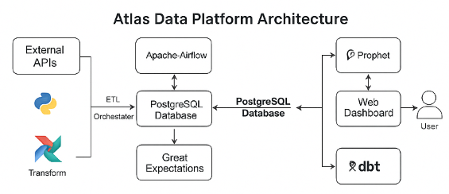

# Atlas Data Platform


[](https://www.python.org/)
[](https://streamlit.io/)
[](https://www.postgresql.org/)
[](https://airflow.apache.org/)
[](https://www.getdbt.com/)
[](https://greatexpectations.io/)
[](https://facebook.github.io/prophet/)
[](LICENSE)


---

## Author

**Harun SEZGIN**  
Data Engineering & Analytics Enthusiast  
[LinkedIn](https://www.linkedin.com/in/harun-sezgin-925a2924b/) · [GitHub](https://github.com/sezg0002)

---

## Overview

Atlas Data Platform is an end-to-end data intelligence product designed with production-grade architecture patterns. 

The project covers the complete lifecycle of a modern data product:

1. **Ingesting** external economic and financial data from public APIs
2. **Loading** and structuring data into a PostgreSQL data warehouse
3. **Transforming** raw data into analytics-ready models with dbt
4. **Validating** data quality using Great Expectations
5. **Orchestrating** the workflow with Apache Airflow
6. **Forecasting** future trends with Prophet ML models
7. **Visualizing** insights through an interactive Streamlit dashboard

---

## Key Features

- ✅ **End-to-end pipeline** from ingestion to visualization, fully reproducible locally
- ✅ **Modern data stack** combining PostgreSQL, dbt, Airflow, Great Expectations and Streamlit
- ✅ **Modular architecture** with clean separation of concerns and reusable components
- ✅ **Economic and financial indicators** collected from real public APIs
- ✅ **Dimensional data model** (fact and dimension tables) implemented in PostgreSQL
- ✅ **dbt models** with staging, marts, documentation and tests
- ✅ **Comprehensive data quality checks** with referential integrity validation
- ✅ **Time-series forecasting** with Prophet, including cross-validation metrics
- ✅ **Professional dashboard** with tabs, interactive charts and model evaluation
- ✅ **Containerized database** using Docker Compose for easy setup
- ✅ **Structured logging** throughout the ETL pipeline
- ✅ **CI/CD ready** with GitHub Actions workflow

---

## Architecture

### Architecture Overview

The following diagram illustrates the core architecture of Atlas Data Platform:



### Conceptual Flow

```text
                ┌────────────────────────────┐
                │      Data Sources           │
                │ (World Bank, Yahoo Finance) │
                └────────────┬───────────────┘
                             │
                       ETL (Python)
                       + Logging & Retry
                             │
                             ▼
                ┌────────────────────────────┐
                │ PostgreSQL Data Warehouse   │
                │  (Fact & Dimension Tables)  │
                └────────────┬───────────────┘
                             │
                     dbt Models & Tests
                     (Staging → Marts)
                             │
                             ▼
                ┌────────────────────────────┐
                │ Great Expectations Checks   │
                │  + Referential Integrity    │
                └────────────┬───────────────┘
                             │
                             ▼
                ┌────────────────────────────┐
                │ Prophet Forecasting (ML)    │
                │  + Cross-Validation Metrics │
                └────────────┬───────────────┘
                             │
                             ▼
                ┌────────────────────────────┐
                │   Streamlit Dashboard       │
                │  (Modular Components)       │
                └────────────────────────────┘
```

### Components

| Component | Description |
|-----------|-------------|
| **ETL Layer** | Python-based extraction with logging, retry logic, and batch inserts |
| **PostgreSQL Warehouse** | Dimensional model with fact and dimension tables |
| **dbt Models** | Staging and marts layers with documentation and tests |
| **Great Expectations** | 15+ validation checks including referential integrity |
| **Orchestration** | Airflow DAG for automated pipeline execution |
| **ML Layer** | Prophet forecasting with cross-validation and metrics |
| **Dashboard** | Modular Streamlit app with tabs and interactive visualizations |

---

## Tech Stack

| Layer | Technology | Description |
|-------|------------|-------------|
| **Orchestration** | Apache Airflow | Manages ETL and dbt job scheduling |
| **Data Modeling** | dbt (Postgres adapter) | Transforms raw tables into analytics models |
| **Data Quality** | Great Expectations | Data validation and expectations framework |
| **Database** | PostgreSQL 15 | Central data warehouse |
| **ETL** | Python, Pandas, SQLAlchemy | Data extraction and ingestion with logging |
| **Forecasting** | Prophet | GDP time-series predictions with metrics |
| **Visualization** | Streamlit, Plotly | Interactive analytics dashboard |
| **Environment** | Docker Compose, virtualenv | Local reproducible environment |
| **CI/CD** | GitHub Actions | Automated testing and linting |

---

## Data Sources

Atlas Data Platform uses two main external data sources:

| Source | Type | Description |
|--------|------|-------------|
| **World Bank API** | Macroeconomic | GDP per capita by country (2000-2023) |
| **Yahoo Finance** | Financial | Market indices (SPY) via `yfinance` |

These sources were chosen for their public availability, relevance for analysis, and suitability for time-series forecasting. 

---

## Repository Structure

```text
atlas-data-platform/
│
├── etl/
│   ├── __init__.py
│   ├── run_etl.py             # Main ETL orchestration
│   ├── worldbank. py           # World Bank API extraction
│   ├── yfinance_data.py       # Yahoo Finance extraction
│   ├── load_to_db.py          # Batch loading to PostgreSQL
│   ├── config.py              # Database configuration
│   ├── logger.py              # Centralized logging
│   └── utils.py               # Retry decorator & utilities
│
├── ml/
│   ├── __init__. py
│   └── forecast_gdp.py        # Prophet forecasting with metrics
│
├── validation/
│   ├── __init__. py
│   └── run_ge_checks.py       # Enhanced GE validation suite
│
├── dashboard/
│   ├── __init__.py
│   ├── app. py                 # Main Streamlit application
│   ├── config.py              # Dashboard configuration
│   ├── database.py            # Database queries & caching
│   ├── components/
│   │   ├── __init__.py
│   │   ├── _imports.py        # Centralized imports helper
│   │   ├── header.py          # Header component
│   │   ├── sidebar.py         # Filters sidebar
│   │   ├── kpis.py            # KPI cards
│   │   ├── charts.py          # Plotly charts
│   │   ├── statistics.py      # Statistics section
│   │   ├── forecast.py        # Prophet forecast section
│   │   └── footer.py          # Footer component
│   └── utils/
│       ├── __init__.py
│       └── formatters.py      # Number/date formatters
│
├── dbt_project/
│   ├── dbt_project.yml        # dbt configuration
│   ├── models/
│   │   ├── staging/
│   │   │   ├── _staging.yml   # Sources & documentation
│   │   │   ├── stg_fact_indicator. sql
│   │   │   └── stg_dim_country.sql
│   │   └── marts/
│   │       ├── _marts.yml     # Model documentation & tests
│   │       ├── agg_kpi_by_country.sql
│   │       ├── agg_yearly_trends.sql
│   │       └── agg_country_comparison.sql
│   └── macros/
│       └── calculate_growth.sql
│
├── airflow_dags/
│   └── gdi_pipeline_dag.py    # Airflow DAG
│
├── tests/
│   ├── conftest.py            # Pytest fixtures
│   ├── test_worldbank.py      # ETL tests
│   └── test_validation.py     # Validation tests
│
├── docs/
│   └── architecture.png       # Architecture diagram
│
├── db/
│   └── schema.sql             # Database DDL
│
├── . github/
│   └── workflows/
│       └── ci. yml             # GitHub Actions CI
│
├── docker-compose.yml         # PostgreSQL container
├── requirements.txt           # Python dependencies
├── . env. example               # Environment template
├── . gitignore
├── LICENSE
└── README.md
```

---

## Installation and Setup

### Prerequisites

- Python 3. 11+
- Docker & Docker Compose
- Git

### 1. Clone the repository

```bash
git clone https://github.com/sezg0002/atlas-data-platform.git
cd atlas-data-platform
```

### 2. Create and activate virtual environment

```bash
python -m venv venv

# macOS / Linux
source venv/bin/activate

# Windows
venv\Scripts\activate
```

### 3. Install dependencies

```bash
pip install -r requirements.txt
```

### 4. Configure environment variables

```bash
cp .env.example .env
```

Edit `.env` with your configuration:

```env
POSTGRES_USER=gdi_user
POSTGRES_PASSWORD=gdi_password
POSTGRES_DB=gdi_db
POSTGRES_HOST=localhost
POSTGRES_PORT=5432
```

### 5.  Start PostgreSQL

```bash
docker compose up -d

# Verify container is running
docker ps
```

### 6. Initialize database schema

```bash
# Connect to PostgreSQL and run schema
docker exec -i gdi-postgres psql -U gdi_user -d gdi_db < db/schema.sql
```

### 7. Run ETL pipeline

```bash
python -m etl.run_etl
```

### 8. Launch dashboard

```bash
streamlit run dashboard/app.py
```

Access the dashboard at: **http://localhost:8501**

---

## Usage Guide

### Dashboard Navigation

The dashboard is organized into three tabs:

| Tab | Description |
|-----|-------------|
| 📊 **Vue d'ensemble** | Historical trends and descriptive statistics |
| 📈 **Analyse détaillée** | Year-over-year growth analysis |
| 🔮 **Prévisions** | Prophet forecasting with model metrics |

### Sidebar Filters

- **Domaine**: Choose between Economy or Finance data
- **Pays**: Select country (for economic data)
- **Actions**: Refresh data or clear cache

### Forecast Options

- **Années à prévoir**: Adjust forecast horizon (1-10 years)
- **Composants**: View extracted trend component
- **Métriques**: Display model performance (MAE, RMSE, MAPE)

---

## dbt Models

### Staging Layer

| Model | Description |
|-------|-------------|
| `stg_fact_indicator` | Cleaned fact table with joined dimensions |
| `stg_dim_country` | Country dimension with region mapping |

### Marts Layer

| Model | Description |
|-------|-------------|
| `agg_kpi_by_country` | KPIs by country with YoY growth |
| `agg_yearly_trends` | Yearly aggregated statistics |
| `agg_country_comparison` | Country comparison with CAGR |

### Running dbt

```bash
# Run all models
dbt run --project-dir dbt_project

# Run tests
dbt test --project-dir dbt_project

# Generate documentation
dbt docs generate --project-dir dbt_project
dbt docs serve --project-dir dbt_project
```

---

## Data Quality

### Validation Checks

The enhanced Great Expectations suite includes:

| Category | Checks |
|----------|--------|
| **Null Checks** | value, indicator_code, country_code, date |
| **Value Constraints** | GDP between 0 and 500,000 |
| **Valid Values** | domain, country_code, unit |
| **Referential Integrity** | fact → dim_country, fact → dim_date |
| **Data Freshness** | Data not older than 365 days |
| **Uniqueness** | Primary keys, composite keys |

### Running Validations

```bash
python -m validation.run_ge_checks
```

---

## Machine Learning

### Prophet Forecaster

The enhanced ML module provides:

- **Cross-validation** with configurable parameters
- **Performance metrics**: MAE, RMSE, MAPE, Coverage
- **Multi-country forecasting** capability
- **Trend component** extraction and visualization

### Usage

```python
from ml.forecast_gdp import GDPForecaster

# Single country forecast
forecaster = GDPForecaster("FRA")
forecaster.train()
forecast = forecaster.predict(periods=5)
metrics = forecaster.evaluate()

# Multi-country comparison
from ml.forecast_gdp import compare_countries
comparison = compare_countries(["FRA", "USA", "DEU"])
```

---

## CI/CD

### GitHub Actions Workflow

The project includes a CI pipeline (`.github/workflows/ci.yml`) that:

1. ✅ Runs on push and pull requests to `main`
2. ✅ Sets up Python 3.11
3. ✅ Installs dependencies
4. ✅ Runs pytest tests
5. ✅ Checks code style with ruff

### Running Tests Locally

```bash
# Install test dependencies
pip install pytest pytest-cov ruff

# Run tests
pytest tests/ -v

# Run linter
ruff check . 
```

---

## Airflow Integration

### DAG Overview

The `gdi_full_pipeline` DAG orchestrates:

```
run_etl → run_ge_validation → run_dbt_models
```

### Running Airflow

```bash
# Initialize Airflow (first time)
airflow db init

# Start Airflow
airflow standalone

# Access UI at http://localhost:8080
```

---

## Development

### Project Commands

```bash
# Start everything
docker compose up -d
python -m etl.run_etl
streamlit run dashboard/app.py

# Run validations
python -m validation.run_ge_checks

# Run dbt
dbt run --project-dir dbt_project

# Run tests
pytest tests/ -v

# Lint code
ruff check .  --fix
```

### Code Style

The project follows:
- PEP 8 conventions
- Type hints where applicable
- Docstrings for public functions
- Modular component architecture

---

## Future Enhancements

| Priority | Enhancement |
|----------|-------------|
| 🔴 High | Deploy to cloud (AWS/GCP/Azure) |
| 🔴 High | Add more data sources |
| 🟡 Medium | Implement Kafka for streaming |
| 🟡 Medium | Add FastAPI for metrics API |
| 🟡 Medium | Advanced ML models (anomaly detection) |
| 🟢 Low | Role-based access control |
| 🟢 Low | Email/Slack alerting |

---

## Troubleshooting

### Database Connection Error

```bash
# Check if Docker is running
docker ps

# Restart PostgreSQL
docker compose down
docker compose up -d

# Check logs
docker compose logs postgres
```

### Import Errors

```bash
# Add project to PYTHONPATH
export PYTHONPATH="${PYTHONPATH}:$(pwd)"

# Or on Windows
set PYTHONPATH=%PYTHONPATH%;%CD%
```

### Prophet Installation Issues

```bash
# Install Prophet (may require additional dependencies)
pip install prophet

# On some systems, you may need:
conda install -c conda-forge prophet
```

---

## License

This project is licensed under the MIT License.  See the [LICENSE](LICENSE) file for details.

---

## Acknowledgments

- [World Bank Open Data](https://data.worldbank.org/)
- [Yahoo Finance](https://finance.yahoo.com/)
- [Streamlit](https://streamlit.io/)
- [dbt](https://www.getdbt.com/)
- [Prophet](https://facebook.github.io/prophet/)

---

<p align="center">
  Created and maintained by <strong>Harun SEZGIN</strong>
  <br>
  ⭐ Star this repo if you find it useful! 
</p>